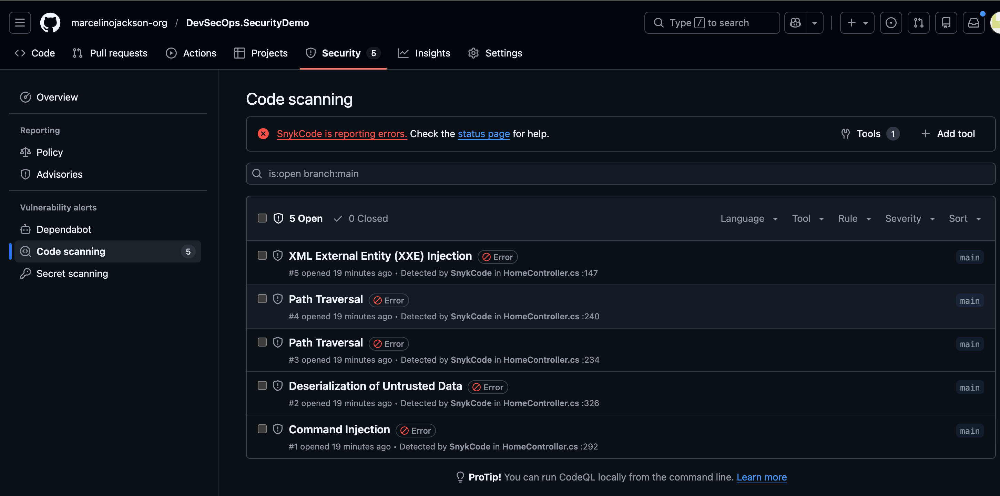
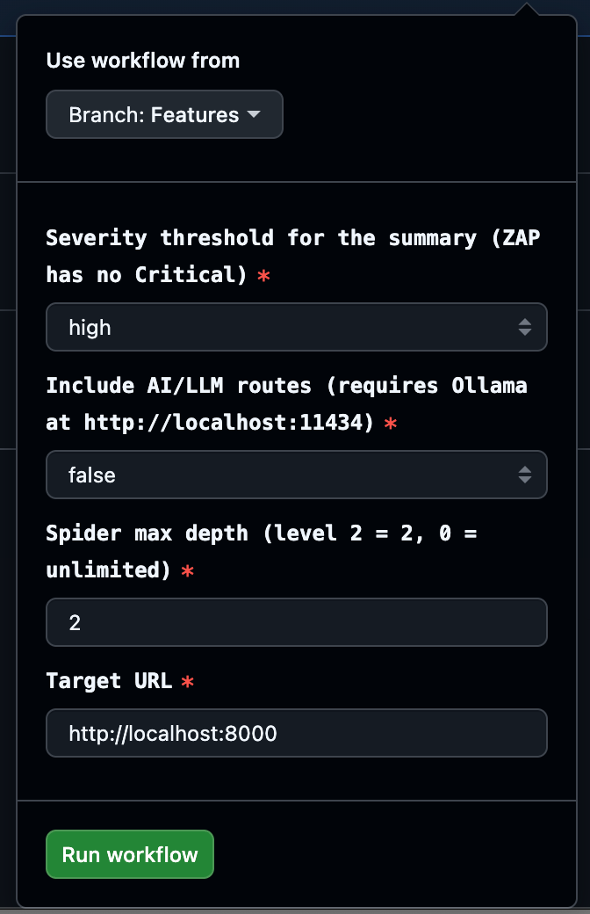
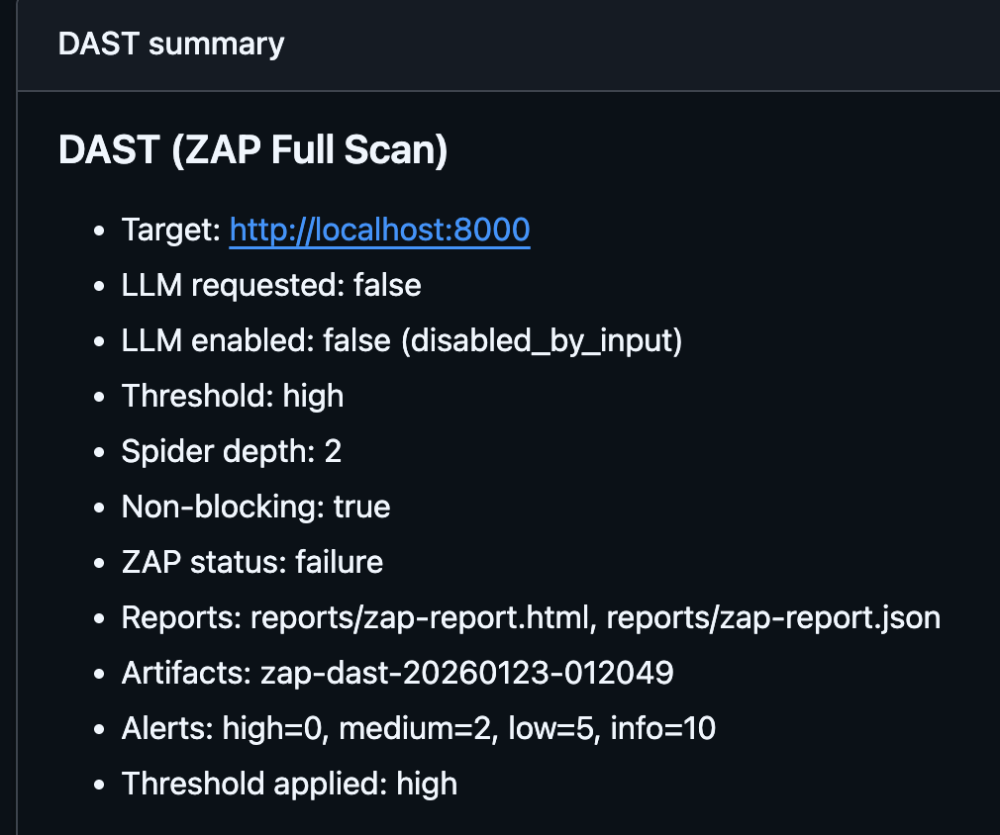

# DevSecOps Security Demo

This repo is a hands-on security testing demo built on a deliberately vulnerable
ASP.NET Core application. It is copied/forked from **AspGoat**
(https://github.com/Soham7-dev/AspGoat) and repurposed to showcase DevSecOps
pipelines. The first test we run here is **SAST**.

## Pipeline catalog (manual-only)

All pipelines in this series are **workflow_dispatch only**. Nothing runs
automatically; each demo is interactive and must be started by you.

| Pipeline | Type | What it does | Sample vulnerabilities |
| --- | --- | --- | --- |
| SAST (this repo) | Static | Snyk Code (SAST) + Snyk Open Source (SCA), uploads SARIF to GitHub Code Scanning. | SQLi, XSS, SSRF, insecure deserialization, dependency CVEs |
| DAST (ZAP Full Scan) | Dynamic | OWASP ZAP full scan against the running app with optional authenticated coverage. | SQLi, XSS, auth flaws, insecure headers |
| SCAScan (Trivy SBOM) | Static | Trivy image scan producing SBOM (CycloneDX JSON) and high/critical CVE summary. | Dependency CVEs in container image |

## Why this exists

- Provide a realistic target with known vulnerabilities for demo workflows.
- Walk through security testing from code to findings.
- Keep the focus on reproducible pipelines over app features.

## What’s included

- The vulnerable ASP.NET Core app (AspGoat base).
- GitHub Actions workflows for security testing.
- SAST + SCA (Snyk Code + Snyk Open Source) as the first pipeline in the series.
- DAST (OWASP ZAP Full Scan) as the follow-up pipeline in the series.
- SCAScan (Trivy SBOM) for container image dependency coverage.
- Detailed runbook: [docs/sast.md](docs/sast.md).
- DAST runbook: [docs/dast.md](docs/dast.md).
- SCA runbook: [docs/sca-scan.md](docs/sca-scan.md).
- DAST tuning: `.zap/rules.tsv` uses ZAP alert IDs (reference: https://www.zaproxy.org/docs/alerts/).

## SAST (Snyk Code) workflow

The SAST workflow is **manual-only** so it never runs without you triggering it.
It runs **Snyk Code (SAST)** and **Snyk Open Source (SCA)**, generating separate
SARIF + JSON outputs. Whether the scans pass or fail, the SARIF is uploaded to
the repo so results are visible in Code Scanning and downloadable as artifacts.

How to run:
1. Go to **Actions** → **SAST (Snyk Code)** → **Run workflow**.
2. Choose the severity threshold, scan path, and exclusions.
3. Review results in **Security → Code scanning** or download the artifacts:
   - `snyk-sast-YYYYMMDD-HHMMSS` (SAST SARIF + JSON)
   - `snyk-sca-YYYYMMDD-HHMMSS` (SCA SARIF + JSON)

### Required secrets

- `SNYK_TOKEN` (required): Snyk auth token from https://app.snyk.io.
- `SNYK_ORG` (optional): Pin scans to a specific Snyk organization ID.

### Prerequisites

- Enable **Snyk Code** for your org after creating the token (Snyk UI:
  Settings/Products -> Snyk Code). The scan fails if Snyk Code is not enabled.

### Screenshot

## DAST (ZAP Full Scan) workflow

The DAST workflow is **manual-only** and runs OWASP ZAP against a running
container of the app. It always uploads HTML/JSON reports and keeps the job
non-blocking for demos.

How to run:
1. Go to **Actions** → **DAST (ZAP Full Scan)** → **Run workflow**.
2. Choose the inputs:
   - `fail-threshold` (high/critical; critical maps to high for ZAP)
   - `include-llm` (true/false)
   - `spider-depth` (default: 2)
   - `target-url` (default: http://localhost:8000)
3. Download artifacts after the run:
   - `zap-dast-YYYYMMDD-HHMMSS` (HTML + JSON)

Notes:
- The workflow logs in with `admin/admin123` to capture an auth cookie so the
  spider/scan can reach authenticated routes.
- If `include-llm=true`, the workflow checks Ollama at `http://localhost:11434`
  and toggles `enableLlmLabs` accordingly.
- Spider depth is controlled by `.zap/hooks/spider.py`.
- Alert tuning lives in `.zap/rules.tsv` and uses ZAP alert IDs:
  https://www.zaproxy.org/docs/alerts/

DAST report samples (click to open):
- [zap-report.html](docs/dast-reports/20260123-012049/zap-report.html)
- [zap-report.json](docs/dast-reports/20260123-012049/zap-report.json)

### DAST screenshots

**Workflow inputs**

**Artifacts and reports**

## DAST configuration files

These files live under `.zap/` and are referenced by the DAST workflow:

- `.zap/hooks/spider.py`  
  Hook loaded by ZAP to set spider/AJAX spider depth (defaults to 2). The depth
  is driven by the `spider-depth` workflow input.

- `.zap/rules.tsv`  
  TSV file for alert actions (IGNORE/WARN/FAIL). Each line uses a ZAP alert ID
  from https://www.zaproxy.org/docs/alerts/. This is the primary place to tune
  DAST noise and demo expectations.

## SCAScan (Trivy SBOM) workflow

The SCA workflow is **manual-only** and scans the built Docker image with Trivy.
It generates a CycloneDX SBOM and a HIGH/CRITICAL summary, then fails the job
if the threshold is met.

How to run:
1. Go to **Actions** → **SCAScan** → **Run workflow**.
2. Choose the inputs:
   - `severity-threshold` (high/critical)
   - `image-tag` (default: aspgoat-sca)
3. Download artifacts after the run:
   - `trivy-sca-YYYYMMDD-HHMMSS` (SBOM + summary)

Notes:
- Trivy honors `.trivyignore` when present for demo suppressions.
- SBOM format is CycloneDX JSON (`reports/trivy-sbom.json`).

## Repo details

This project is copied from AspGoat so we can evolve the demo without waiting
on upstream PR approvals. That independence lets us add security tooling,
workflow changes, and demo-specific tweaks while keeping the original project
intact.

## Safety note

This application is intentionally insecure and for **education/demo only**.
Do not deploy it to production or expose it to the internet.

## Credits

Original vulnerable app: **AspGoat** by Soham7-dev  
https://github.com/Soham7-dev/AspGoat
